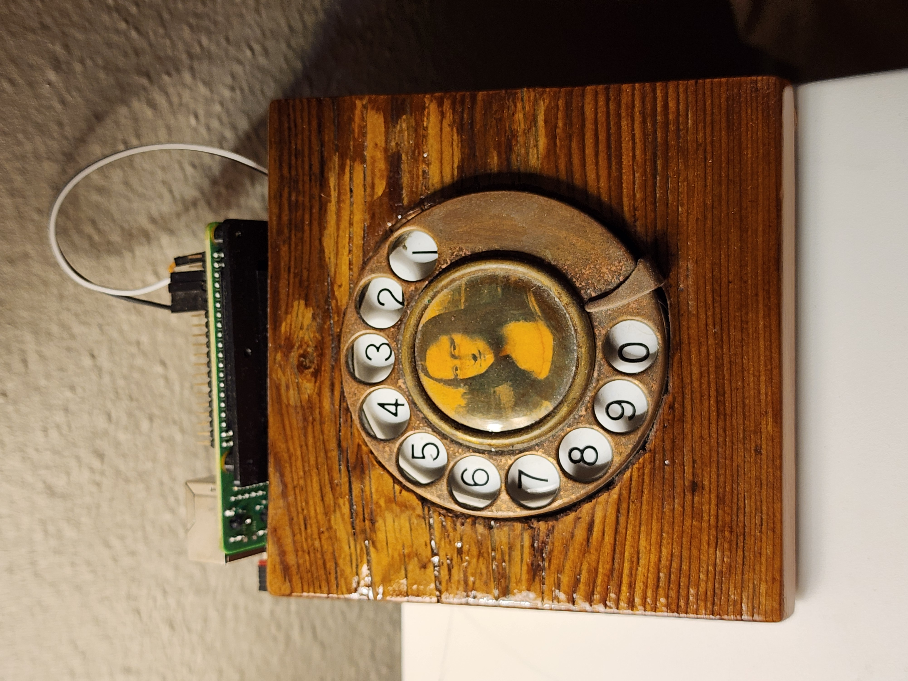

# Rotary

Specialized Python program run on my Raspberry Pi that interfaces with a rotary phone dial to control my bedside lamp and LED Strip. The lights are plugged into smart plugs which allows them to be controlled via Samsung's SmartThings API. The LED strip runs on an Arduino (code [here](https://github.com/TyHil/led-strip-effects-and-game/)) which allows it to be controlled over serial to change mode and act as a light alarm.

This project requires a SmartThings Personal Access Token (PAT) generated before December 30th 2024. Otherwise, the token will need to be changed every 24 hours.

## License

GPL-3.0 License
